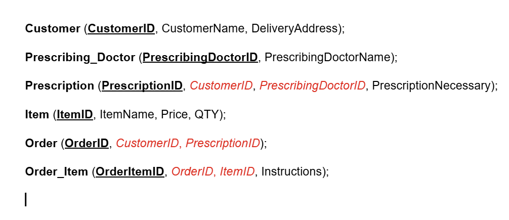
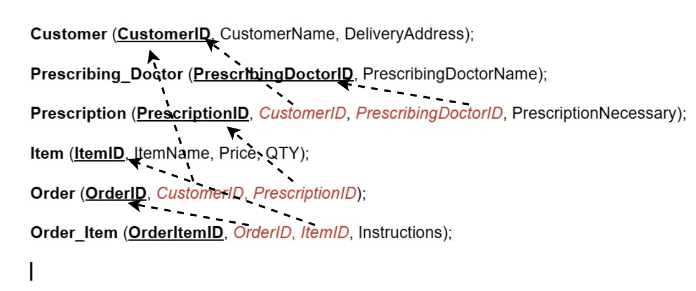
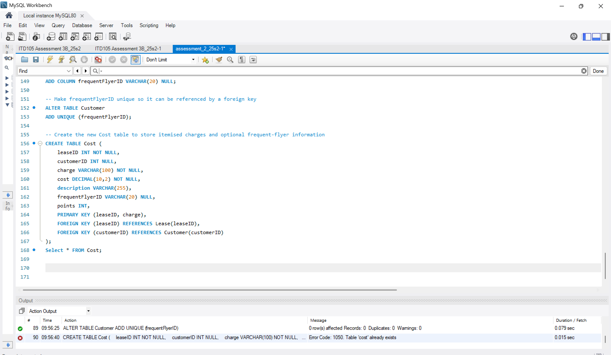

# MySQL School Project

This project demonstrates my use of MySQL for database design, query writing, and reasoning behind choices.  
It includes SQL scripts and screenshots of queries, results, and action outputs.

## Project Overview
- Database tables 
- Performed CRUD operations and sample queries using MySQL.
- Screenshots show SQL code, results, and action outputs.

## SQL Files
- `ITD105 Assessment 3B_25s2.sql` – SQL scripts for the project

## Screenshots

## Reasoning
- MySQL chosen for reliability and relational data handling.
- Applied normalization, indexing, and best practices.
